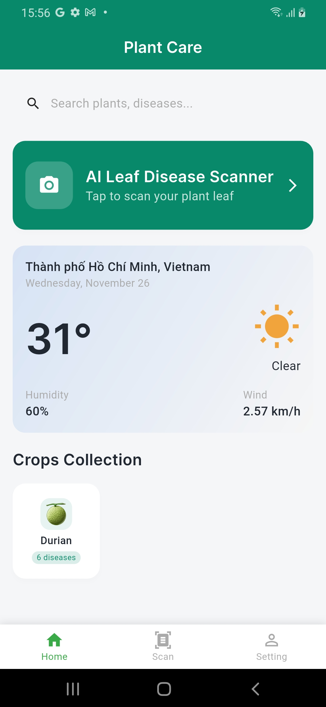
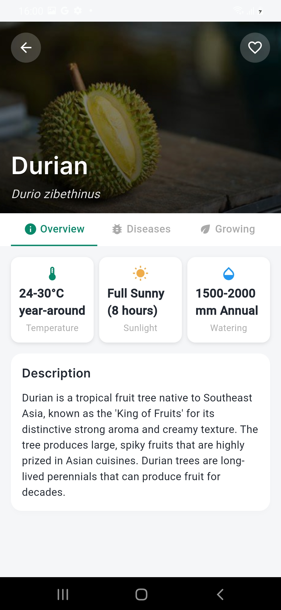
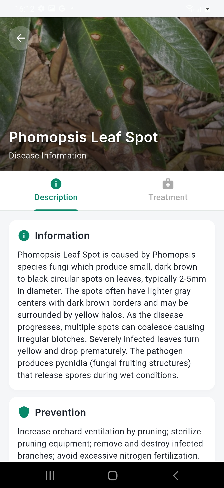
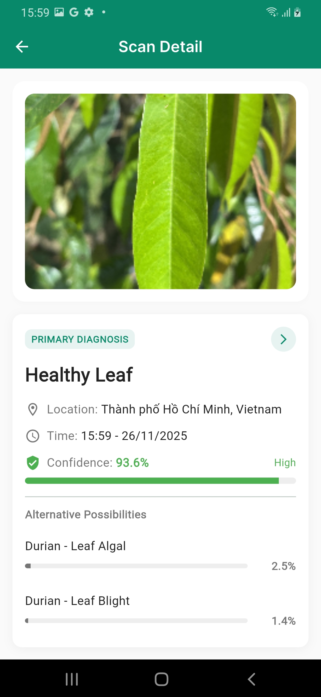
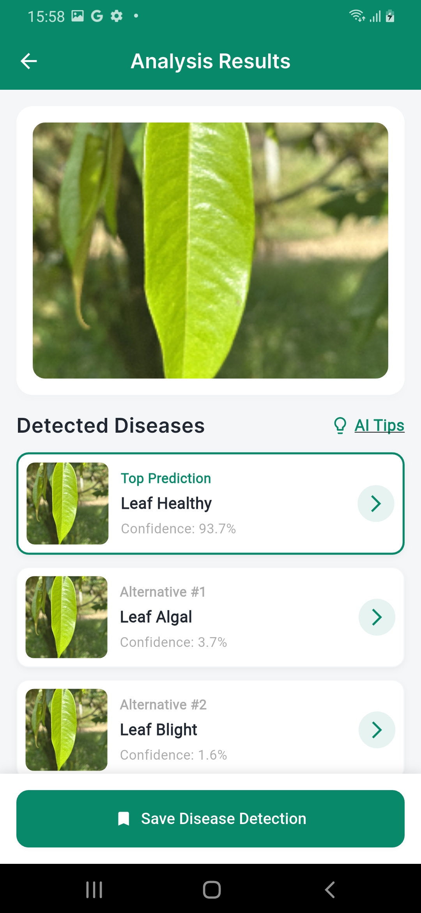
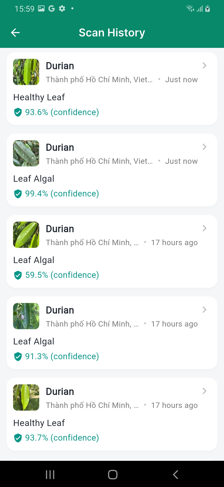

# 🌱 AI-Based Mobile App for Durian Leaf Disease Detection

A comprehensive Flutter mobile application that leverages artificial intelligence to detect plant diseases (durian) through image analysis, providing farmers and gardeners with instant diagnosis and treatment recommendations.
## ✨ Core Features
- **AI-Powered Disease Detection**  
  Real-time camera capture with on-device TensorFlow Lite models for fast, accurate durian leaf disease diagnosis.

- **Knowledge-Based Disease Guidance**  
  Supabase-backed database of durian varieties, diseases, symptoms, scientific information, treatment plans, and prevention tips.

- **Context-Aware Assistance**  
  Location-based weather (OpenWeather API) and basic agricultural insights to adjust care recommendations.

- **Full Mobile Experience**  
  Secure Supabase authentication, user profiles and history, responsive Material Design UI, and smooth animations.

## 📱 App Screenshots
A few key screens from the final mobile application:
<p align="center">
  
  
  
</p>
<p align="center">
  
  
  
</p>

## 🎥 Demo Video

Watch a full demo of the app in action: 
[▶ Watch demo on YouTube](https://youtu.be/Ddg2aPrygS8)

## 🧠 AI Implementation

### 📊 Data
- Training: Durian leaf disease dataset on Mendeley Data  
  https://data.mendeley.com/datasets/pxzvksbwnj/4 
- Cross-Validation: Self-collected practical durian dataset on Vietnamese field  
  https://www.kaggle.com/datasets/phihngtrnnguyn/pratical-durian 

### 🧮 Model
- Full training pipeline and TFLite export in Kaggle Notebook  
  https://www.kaggle.com/code/phihngtrnnguyn/mobilenetv3-large-dl-pipeline-42 [web:210]
## 🚀 Installation & Setup

### **1. Clone the Repository**
```bash
git clone <repository-url>
cd plant_ai_disease_flutter
```

### **2. Install Flutter Dependencies**
```bash
flutter pub get
```

### **3. Environment Configuration**
Create a `.env` file in the root directory based on `.env.example`:
```bash
cp .env.example .env
```

Edit the `.env` file with your configuration:
```env
# Supabase Configuration
SUPABASE_URL=your_supabase_project_url
SUPABASE_ANON_KEY=your_supabase_anon_key

# Weather API Configuration
OPENWEATHER_API_KEY=your_openweather_api_key

# App Configuration
APP_NAME=Plant AI Disease Detection
DEBUG_MODE=true
```

### **4. TensorFlow Lite Models Setup**
Place your trained `.tflite` model files in the `assets/models/` directory:
```
assets/
  models/
    plant_disease_model.tflite
    labels.txt
```

### **5. Database Setup (Supabase)**
1. Create a new Supabase project
2. Run the SQL setup script: `supabase_setup.sql`
3. Configure Row Level Security (RLS) policies
4. Update your `.env` file with Supabase credentials

### **6. Verify Installation**
Check that Flutter is properly configured:
```bash
flutter doctor
```

